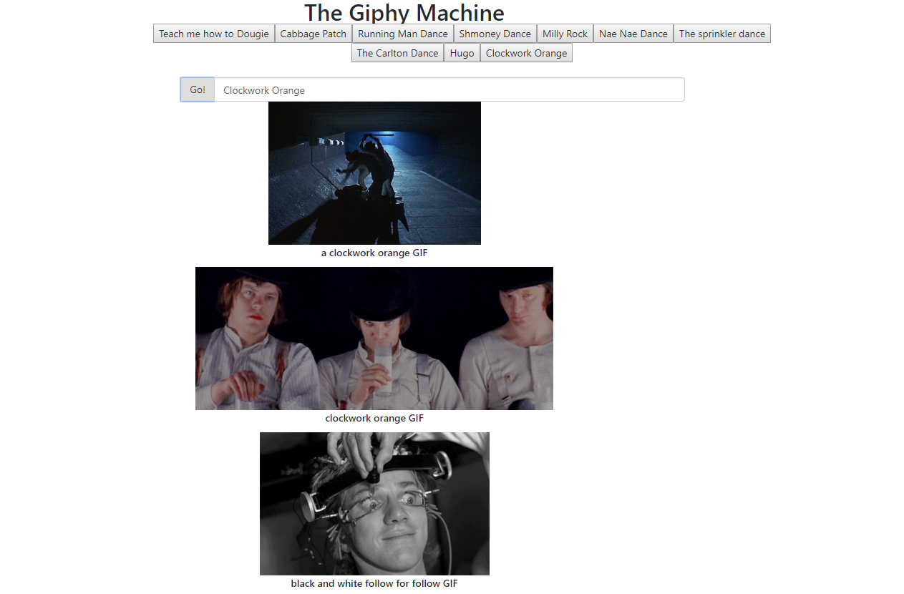

 
# ProPublica Scrapper    
 This app uses Jquery, Ajax, and javascript to over come 
 problems with content generation. 

## Problem solved
1. Uses AJAX to fetch Giphy data from API endpoint.  
2. Uses Jquery to dynamically create buttons for new content.  

## Deployed Site

[Deployed App](https://jasonrobnson.github.io/The-Giphy-Machine/)

# Tools
- React.js
- Heroku
- GitHub
- DocToc (Table of Contents)
- Materialize

<!-- START doctoc generated TOC please keep comment here to allow auto update -->
<!-- DON'T EDIT THIS SECTION, INSTEAD RE-RUN doctoc TO UPDATE -->
**Table of Contents**  *generated with [DocToc](https://github.com/thlorenz/doctoc)*
- [Frontend](#Frontend)
  - [BootStrap](https://getbootstrap.com/)
  - [Giphy](https://developers.giphy.com/docs/)
  - [JQuery](https://jquery.com/)

- [Development Tools](#development-tools)
  - [Heroku](https://www.heroku.com/)
  - [GitHub](https://github.com/JasonRobnson)
  - [DocToc](https://github.com/thlorenz/doctoc)

<!-- END doctoc generated TOC please keep comment here to allow auto update -->

## Instructions
 When you click on any of the buttons, you'll get list of Giphy's with under 
 that particular keyword. If you're feeling even more daring, you can
enter your own keywords into the search bar, and see it what returns. 

